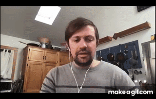
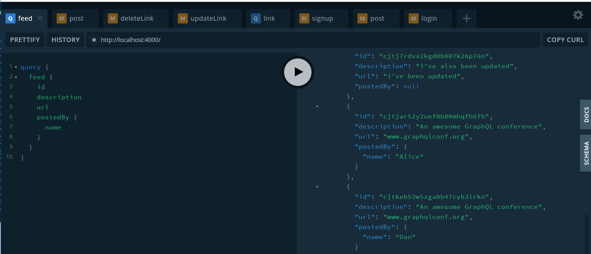
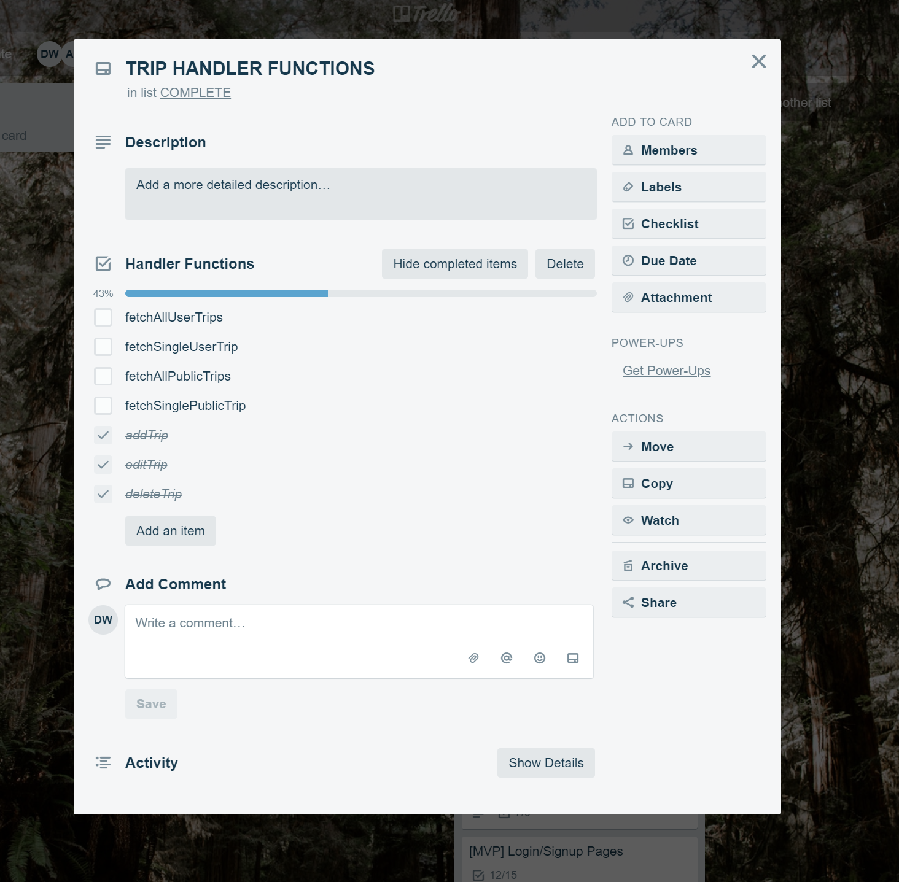

1 week down, 4 to go.  Our first meeting with Brian, who is acting as both CTO and the client for this project, was a bit of a shock to both myself and the team.  Over the course of our 15 week full stack curriculum at Lambda, we were taught a stack using React for the front end, and a RESTful API approach using Node.js and express for the backend.  Imagine our surprise when we learned that project we inherited from Labs 9 and Labs 10 Team Home used GraphQL/Apollo/Prisma for the backend, which none of the 5 of us had ever touched.  Our end goal is to add a TODO list feature to an existing project management service similar to Basecamp and Trello.

Not only were we going to be using a foreign stack, our first meeting with a member of the previous Team Home alerted us to an issue with the codebase that would require attention for this and future iterations.  Our team struggled with this and ultimately came up with a few options for moving forward: 

1. Keep the code base as is and continue building with the anti-pattern in the code.
2. Refactor the whole code base using the same stack with a better implementation.
3. Refactor the whole code base using the Lambda stack.

I was tasked with presenting our options to Brian, in what was probably a very similar meeting as to what would happen in a real world scenario when a team of engineers realized that a major refactor was likely necessary.  Brian and the team ultimately decided on option 2, a complete refactor using the same stack as already implemented, which would allow us to reuse much of the API to save time, while still allowing us to refactor.

Also, in order to meet the goals of Week 1 in Labs, we successfully deployed the front and back end of the prior teams project.  This took the better part of a day, as we had to create many accounts on sites of  the third party API’s which the project used, and set up environmental variables on Heroku/Netlify corresponding to our credentials on those sites.

---

**Detailed Analysis:**

The rest of the week was spent digging into the basics of GraphQL and Prisma in preparation of the refactor which will begin on Monday.  I was very intimidated trying to learn GraphQL without any instructors, but simply following an online tutorial.  However, the tutorial proved invaluable, and the entire team was able to complete it together leading to us feeling much better about the tasks ahead.

We were able to implement a GraphQL server with full CRUD functionality, and connect it to a database for data persistence using Prisma.  While I certainly don’t feel like an expert on GraphQL/Prisma at the moment, I’m miles ahead of where I was when we inherited the project and feeling more comfortable about digging in the code base come monday.

---

**Milestone Reflections:**

As our project differs from most other Lambda Labs projects in that we are not starting from scratch, but rather inheriting a working application and code base, our TDD (Technical Design Document) is likely very different from most others.  Outside of our meeting with Brian to discuss the technologies we’d be using moving forward, much of the application design had already been decided for us by previous iterations of Team Home.

I researched information on competitors, mostly focussing on Trello which has a similar TODO feature in the form of checklists within a card.

 

Our feature would provide some additional functionality of emailing members when they were assigned to a list, as well as notifying the owner(s) of the list when all of the TODOs have been completed.

I also took the lead on investigating different technological solutions for moving forward with the existing codebase.  As mentioned in the intro, the team came up with a few options for how to refactor the application to resolve the anti-pattern in the code, and I researched the feasibility of these options, finally presenting them to Brian.
