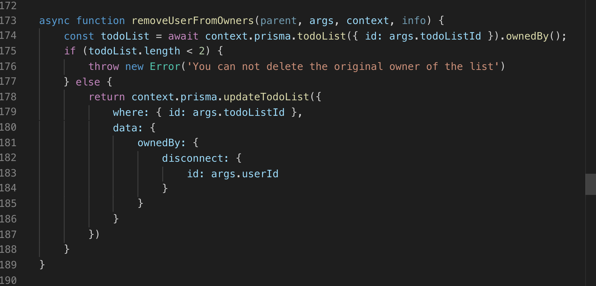

# Weekly Accomplishments

In the second week of labs, I was tasked with getting the backend up the application off the ground, specifically the todos tab, which was our groups addition to the previous codebase.  I didn't get to work much on the front end, but the team is going to be switching roles next week, and I'll be able to get some experience then.  

The week did not go exactly as planned.  Early on we realized that refactoring the backend was not going to be as simple as hoped.  Because the legacy code used MongoDB and we switched to MySQL, many of the existing models had to be rewritten.  Ultimately, the decision to switch to a relational database should help future iterations of this project get up and running much quicker then we did.

A few of my contributions to the project for the week are outlined below.

## Backend

### Getting models set up for the new data
[Github](https://github.com/labs11-teamhome3/labs11-teamhome3BE-refactor/pull/6)
[Trello](https://trello.com/c/mr9BfL1T)

### Updating the graphQL mutations to connect to the Prisma API using context
[Github](https://github.com/labs11-teamhome3/labs11-teamhome3BE-refactor/pull/8)
[Trello](https://trello.com/c/mr9BfL1T)

### Write the mutations to perform all CRUD operations on both todos and todoLists
[Github](https://github.com/labs11-teamhome3/labs11-teamhome3BE-refactor/pull/9)
[Trello](https://trello.com/c/yQdDjZl5)

### Resolved issues with relations between users, teams, todos, todoLists
[Github](https://github.com/labs11-teamhome3/labs11-teamhome3BE-refactor/pull/11)
[Trello](https://trello.com/c/1UQ7mXuB)

# Team dynamic

I'm thrilled to be working with Clint, Yanna, Nick, Kevin, Iyin, and Ivan, with our PM Lauren at the helm.  Unfortunately, because our project is so different then the other labs projects, its been difficult to all stay on the same page with what needs to be done.  

Clint, Yanna, and myself basically knocked out the entire backend of the application this week, which I felt was a great accomplishment, but we likely should have been in better contact with Nick and Kevin on the front end.  What resulted is a near fully functioning app in the GraphQL playground, but not much to show Brian at our weekly check-in.

Also, it's been very difficult to know how to include the iOS team working alongside us.  Our lack of understanding in how iOS development works and what they specifically need from us, has led to what feels like a bit of a divide in the group.

# Detailed Analysis
I'd like to go into a bit more detail about one of the tickets which I was proud of this week.  While most of the week was spent trying to overcome the steep learning curve of graphQL, and the last two days were spent in bed with the flu, I managed to write mutations and queries allowing the front-end to display all the necessary data from the MySQL database.

The main gist of the function is that the user can remove another user from the list of owners of a todoList.  This is similiar to a few other mutations namely removeFromAssignees.  However, one of the stipulations from the wireframe given to the team was the the last owner of the todoList cannot be removed.  We don't want to have orphaned todoLists running around with no owners.

Thus, the top part of the function exists to:
1. Query the database and find the todoList in question.
2. Call the `ownedBy()` function to return an object with an array of owners of the todoList
3. Throw an error if the user tries to the delete the list when it has only 1 owner
4. Delete the owner if there are more than 2 owners.

***

Tonight we have another check-in with Brian to discuss the achievements of the week and to see whether we hit our lofty goals from monday.  Hopefully, I'll kick this physical bug and get back to the digital ones come Monday.

