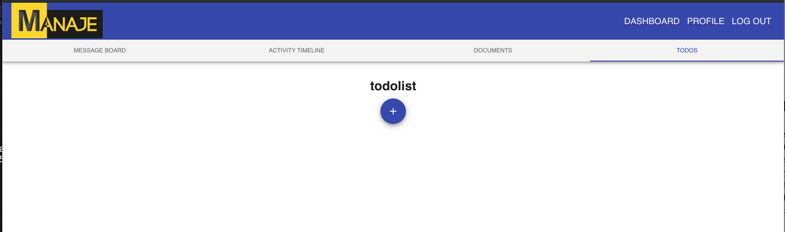
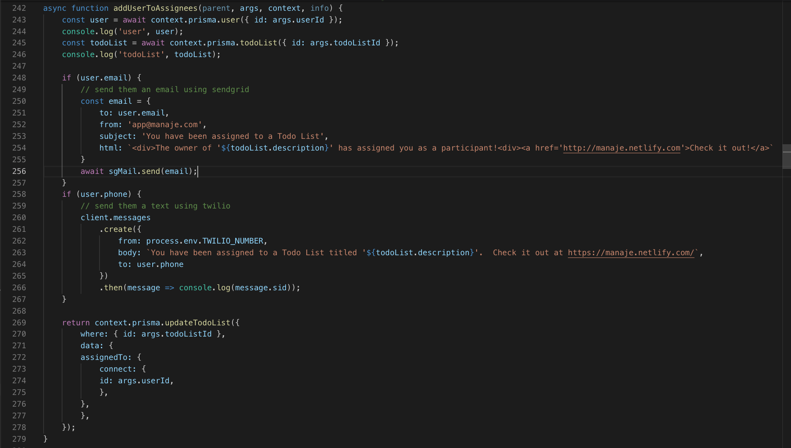

# Weekly Accomplishments

In the third week of labs, I was tasked with finishing off the backend of the application.  Originally, the plan had been to switch over to the front end this week, but since we were already falling behind due to the scope of our project and the refactoring of the previous 2 labs teams' code, I stayed on the back end and continued my work from week 2.  The week went according to plan, and I was able to finish off entire API.  I'm sure some tweaks will be necessary depending on the information the front end is requiring, but the heavy lifting is done.  

It was a major challenge designing the API using GraphQL and Prisma instead of using a RESTful API with Knex as we were taught in the Lambda Web Development curriculum.  It's taken a full 3 weeks of using this new stack, and I'm finally beginning to feel more comfortable with it.  I don't yet see the advntages GraphQL provides over REST, but potentially this is because the scale of our app is miniscule compared to the apps for which GraphQL was invented.

The team decided to make some UI/UX adjustments to the application after a Wednesday meeting with Lambda's UX instructor, and I begun the work implementing some of those changes starting with a redesign of the UI.  Finally, I worked with Clint getting rid of some bugs in the Auth flow.  Previously, the app would require a refresh or two after loggin in to start rendering data from back end, but now that is handled seamlessly.  

Here are some of my major contributions for the week

## Backend Tasks

### Added email and text notifications when a user is assigned a todo list, or notifying the owners of a todo list when all of the tasks in a todo list are complete.

[Github](https://github.com/labs11-teamhome3/labs11-teamhome3BE-refactor/pull/41)
[Trello](https://trello.com/c/ma8NNXAe)

### Restricted non-premium users to only 1 team, and only 5 members on that team
[Github](https://github.com/labs11-teamhome3/labs11-teamhome3BE-refactor/pull/42)
[Trello](https://trello.com/c/llVE1gY5)

### Added all CRUD operations to the API for events, tags, messages, and message comments.
[Github](https://github.com/labs11-teamhome3/labs11-teamhome3BE-refactor/pull/22)
[Trello](https://trello.com/c/KSddtk06)

## Front End Tasks

### Auth flow changes, and UI improvements
[Github](https://github.com/labs11-teamhome3/labs11-teamhome3FE-refactor/pull/27)
[Trello](https://trello.com/c/VaToZsnl)

# Team Dynamic
The team dyanmic is strong, and everyone seems to be enjoying working together as through the 3rd week.  It's become clear that some of the team prefers to work alone at different hours then the rest of the team, which has made collaboration a bit difficult.  Since Clint and I have mostly been working on the backend together, we've been on video call for most of the week.  I find it helpful to have another pair of eyes when I run into a problem, and have been able to lend a hand helping as well.

The 2 iOS members of the team Iyin and Ivan, have definitely felt like more a part of the team this week then in the past.  On the web side, we've had to work more closely with them this week, making sure the API is returning the necessary data for them to build out the mobile application.  We're also working with the iOS guys to refactor the UI/UX of the and having their opinions on design is proving helpful.

# Detailed Analysis

Here I'll go into a bit more detail about one my accomplishments for the week of which I was the most proud.  I had worked with email and text thrid party API's in the past, but never implemented them in a complete application before.  The previous labs team used the Sendgrid API to send email and the Twilio API to send text messages to team members when certain actions were completed in the app.  Our team's addition of the Todo tab, came with additional needs from these two APIs.  

1. Users who are assigned a todo list should receive a text/email notifying them of this.
2. Owners of a todo list should receive a text/email when all of the tasks are complete.

This function below handles the emailing/texting of users who are assigned to a todo list.

The function takes in the 4 main arguments of a graphQL resolver: `parent`, `args`, `context`, `info`.  Then the following steps occur:

1.  When the function is called from the front end, the logged in user's id and the id of the todo list they are being assigned to are passed in as `args`.
2.  Line 243: The correct user is found in the database using prisma.
3.  Line 245: The correct todoList is found in the database using prisma.
4.  Lines 248-256:  If the user has an email address on file, the Sendgrid API is used to send a pre-formatted email address to the user notifying them of their assignment
5.  Lines 258-267:  The same as step 4, but for text messages using the Twilio API.
6.  Lines 269-278:  The user is added to the array of assignees to this particular todoList in the database.

We also must send texts/emails to the owners of a todo list when all of the tasks have been completed.  This function is very similar to the one above, but instead of finding the assigned user by his userId, we'll find the array owners of the corresponding todo list, and iterate over that array using `forEach`, sending the owners an email or text depending on the information they have on file.

If the team is able to complete the MVP of the app, I'd like add something to this function.  It would likely become a bit of a nuisance to receive texts and emails every time you were assigned a todo list.  It would make sense for the user to have an option to not allow texts/emails for certain actions on the site.  This would prevent spam and misuse. 

# Weekly Reflection

Obviously, it's been very difficult not only trying to learn a new stack, but also refactor existing code using that stack sub-optimally.  One of the ways we've attacked this as a team has been for each team member to attempt to specialize in either the front or back end.  This has been a very helpful process so far, as I feel very comfortable working with GraphQL and Prisma Client with regards to designing the API for the app.  However, now that the back end is complete and I'm moving to help on the front end, I'm somewhat forced to go back to learning mode before I'm able to dig in and actually write any functional code.

Nick and Kevin have been on the front end since day 1, spending approximately a week learning how to use Apollo client to interact with the GraphQL API.  Unfortunately, the team doesn't have the time for Clint, Yanna, and myself to spend a week doing tutorials and learning how the front end works.  That would be half of the remaining time we have to develop the app.  But, it's hard to even know where to begin without some level of understanding of the stack used.  In addition, the team decided to use React Hooks on the front-end, adding another layer of learning before I feel comfortable jumping in to the code.

Ideally, the MVP would have been 100% completed this week, with the final two weeks dedicated to bug fixing and polishing the app.  Due to the scope of our project, and the additional work we've taken on with the refactor, I'd say were close to 75% complete.  The back end is finished, and 2 of the 4 major components on the front end are complete.  Hopefully, with the entire team working on the front end next week, we'll be able to have a working product by the middle of the week.  This would leave us a good week and a half to deal with bugs a polish the app into something we are all proud of.

