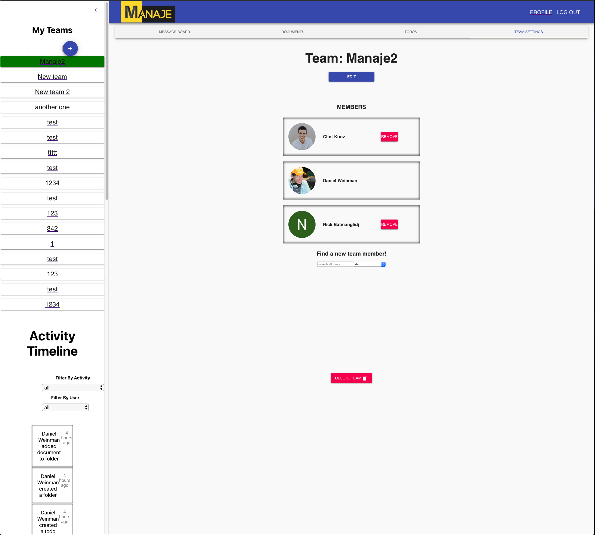

# Weekly Accomplishments

Week 4 of Lambda Labs is almost complete.  This week, with the backend API basically finished, the team set it's sights on getting the MVP for the front end completed.  At the beginning of the week, about 50% of the front end pages were rednered and functional, and we were able to get to about 95% functionality with just a few lingering bugs.

The image above shows the majority of my work for the week.  The Dashboard and Activity timeline were moved into a collapsable drawer on the left side of the page.  I was also responsible for building out the Team Settings page, where admin users can perform maintenence operations on the team such as adding/removing members, or upgrading the team to premium to allow for extended functionality.

Some of my major contributions for the week are below:

## Front end tasks

### Created the Team Settings page
[Github](https://github.com/labs11-teamhome3/labs11-teamhome3FE-refactor/pull/29)
[Trello](https://trello.com/c/Ve2qI4EF)

### Integrated the Activity Timeline to display events occuring within the team
[Github](https://github.com/labs11-teamhome3/labs11-teamhome3FE-refactor/pull/47)
[Trello](https://trello.com/c/QnkXWz2m)

### Removing the Dashboard route and integrating it into the Team View
[Github](https://github.com/labs11-teamhome3/labs11-teamhome3FE-refactor/pull/55)
[Trello](https://trello.com/c/qpe3wQZi)

### Finalizing the auth flow to fix some UX bugs
[Github](https://github.com/labs11-teamhome3/labs11-teamhome3FE-refactor/pull/56)
[Trello](https://trello.com/c/CJwHPsKD)

# Detailed Analysis

One of the toughest challenges for the week was taking the DashboardView component and the ActivityTimline component, and finding a way to extract them into a Material-UI drawer component.  I had never really worked with Material-UI, but found it rather intuitive, and was able to get those original two components to render inside of the drawer.

Here we can see the Drawer component.  It is exported wrapped by `withStyles` making it a higher order component and allowing us to bring in some Material-UI previously written css.  This saved a ton of time in not having to code the drawer and style in ourselves.  On line 208, we see the DashboardView being rendered, and the ActivityTimeline below on line 210.  This drawer component is rendered in the Team View, which ends up looking like the image below.

Unfortunately, this brought on a myriad of bugs that took over half a day to fix.  Like previous weeks, most of my blockers involve using the unfamiliar stack.  While working on the backend, it was GraphQL giving me problems.  On the front end, we use a library called Apollo Client to interact with the GraphQL API.  Once again, there's a fairly steep learning curve for Apollo compared to using a library such as axios for a RESTful API.

The team also decided to use React Hooks, which I had previously never touched, so there was an extra bit of learning to do in order to understand how hooks allow for state inside of a function component with `useState`, as well as understanding how the lifecycle methods from React class components area replaced by the `useEffect` hook.

# Weekly Reflection

The main goal for the team this week (as definited in the Lambda Labs Week 4 spreadsheet) was to begin work on the UX/UI on the site.  Unfortunately, because of the scope of our project, we were more focused on finishing off the MVP functionality before we got into UX/UI.  We did have a meeting with the Lambda UX instructor, and she gave us some great ideas about how to restructure some existing component on the site to make more sense and be more intuitive to the average user.

After the meeting, some of the team got together and used Balsamiq to create some new wireframes for how we want the UI of the site to appear.  This was a great experience, getting to play the part of Designer while knowing we'd be the ones building these views in the coming days.

Above is one of the views we created in Balsamiq.  We see the drawer on the left side of screen displaying the TeamList and the Activity Timeline.  When I implemented this drawer in the front end, it was crucial having this wireframe as a guide to both style and fuctionality.  The hour or so the team spent discussing UX/UI and making these wireframs saved countless hours while developing.  It also gave the team a unified guide of how we want to style the app.  Originally, our plan had been for each team members to style the components that they had built trying to follow a style guide that didn't exist.  This wireframe has allowed us to all have a better idea of the looks and feel of the app we're building.

