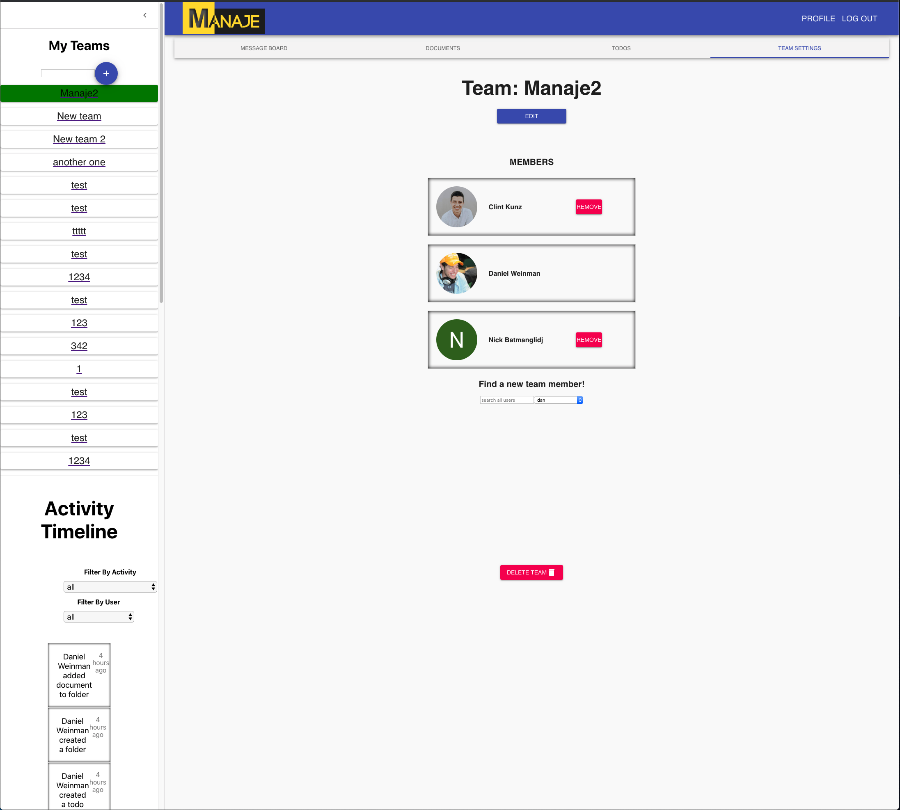
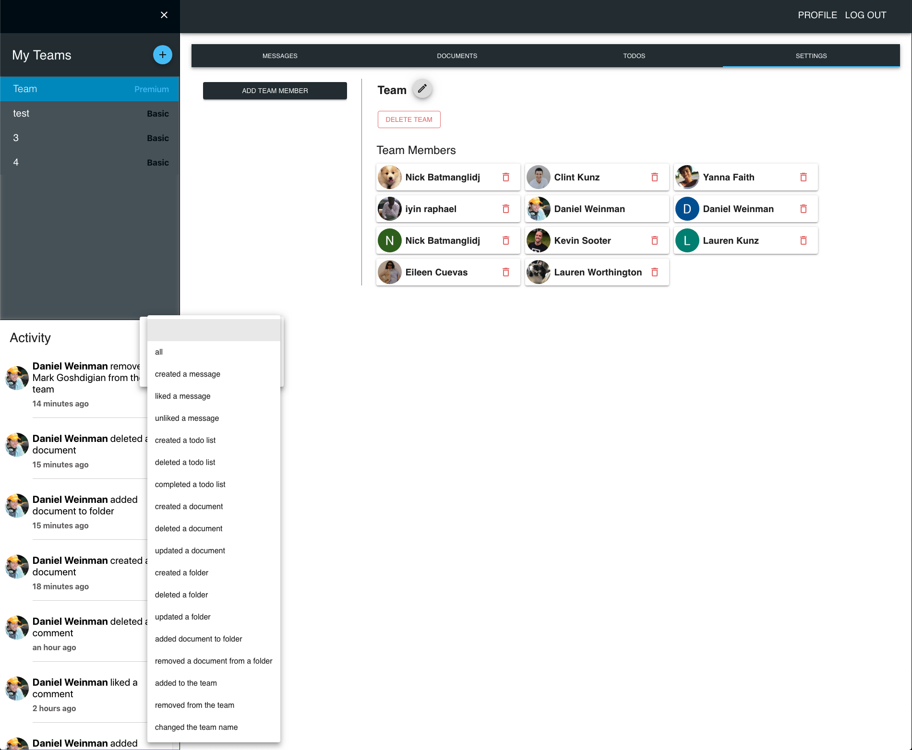
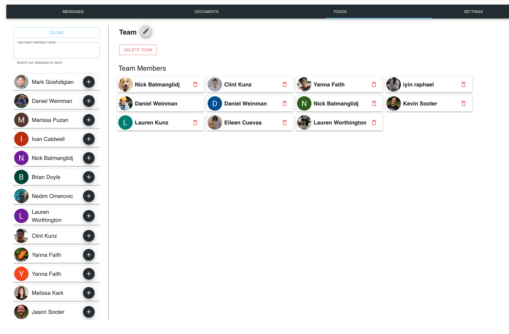
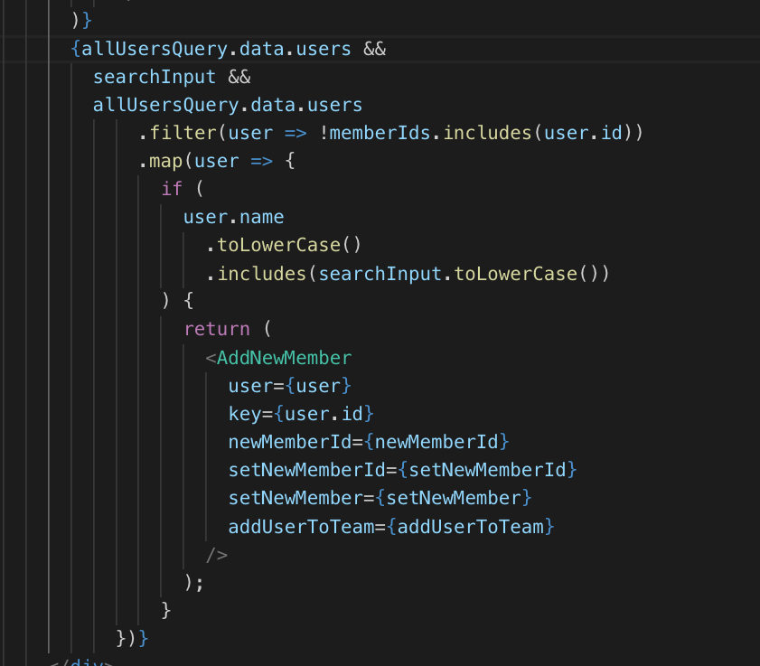

# Weekly Accomplishments 

We've just completed our fifth and potentially final week of labs (pending moving into flex and spending another week on the project).  This week we focused on fixing the remaining bugs in the application, and styling the app with a uniform theme.  The team decided to use MaterialUI for styling all of the components, which was a new technology for me, but ended up working fantastic.  My main focus for the week was the Drawer component, which houses the Team List and Activity Timeline, as well as the Team Settings page where a user can add or remove team members.

MaterialUI was able to help us go from this...

to this...

Originally, we found it somewhat difficult to style some of the MaterialUI components, but eventually the team figured out how to overide some of these styles, and use some higher order components such as the `withStyles` library, to export these MaterialUI components with our styling decisions.  After another meeting with Lambda's resident UX instructor Melissa, we also were able to design a theme for the application using google's theme selection tool, and apply those styles/colors whereever needed.  

In the end, after a long 4 days and nights, we were able to turn a buggy, unstyled app into something I'd be very proud to show off in my portfolio.

# Detailed Analysis

One of my tasks for the week I was most proud of was adding the component which allows the user to find other users to add to the team.  A photo of this component is below, on the left 1/4 of the screen.

Inspired by Airtable's method of choosing a user, I wrote a GraphyQL query to grab all users in the database, and display those users as clickable cards to add a specific user to the team.  There were some interesting engineering choices made in this process.  With a database of hundreds of thousands of users, it'd be silly to display them all at once and make the user scroll through that enormously long list to find a team member.

To solve this, I made sure not to render any of the AddMemberCard's until the user had begun typing in the search box.  Then, I filter out the names that don't match the search criteria or are already on the team.  What's left is an easily traversible list of users.  

Some of the code to achieve this is here...

Here's a quick walkthrough of this conditional render.

- Line 246:  Make sure the query for all users has finished loading and received the data
- Line 247:  Only begin the render if the user has begun typing in the text field
- Line 249:  Filter out the users who are already part of the team
- Lines 250-264:  Map over the remaining users in the database, and render an AddNewMember component if their name matches the search input.

# Weekly Reflection
This week was an awesome preparation for working with a deadline in mind.  The team really wanted to finish off the application this week, and we put in extra hours to accomplish this goal.  I never really understood the 90-90 rule in development until this week.  I was under the assumption that styling the application would take a couple of days max and be a very quick polish at the end of the project.  This was so far from the actual case, as styling the app ended up revealing some more bugs in production, some of which set us back hours as we pair progammed and tried to squash them.

Many of our quirky bugs had to do with the GraphQL cache, and having a bunch of asynchronous state setting functions taking place at once, all while trying to perform actions in a synchronous matter.  These small bugs, which I assumed would be quick one liners to fix, ended up taking up most of our time during the week.

In the end, I'm super proud of what the team was able to accomplish over these 5, potentially 6 weeks, and excited to have this project as part of my personal portfolio.

